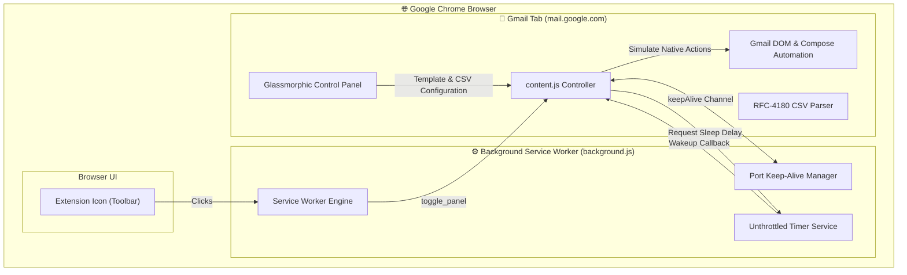
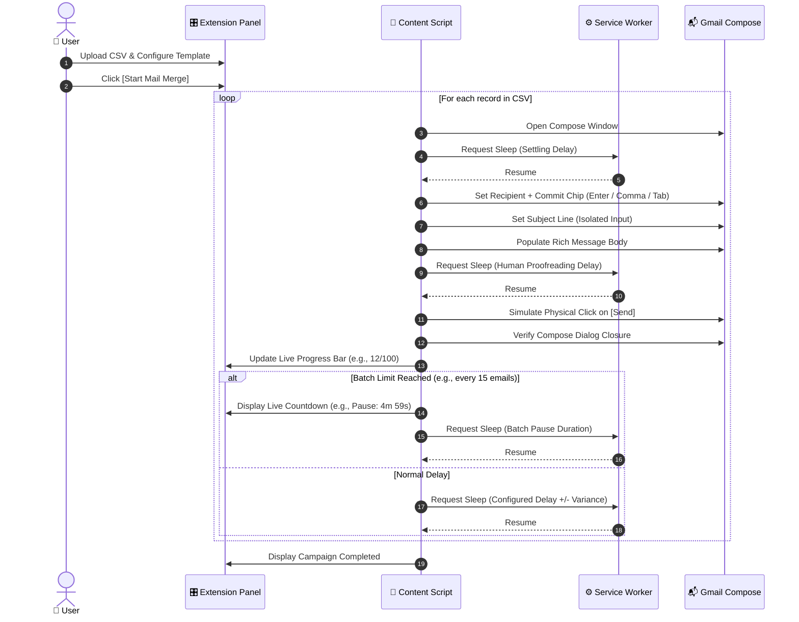

# ✉️ Gmail AutoMail Merge

<div align="center">


<p align="center">
  <br/>
  <b>⚡ Power By NorthPeak Studio</b>
</p>

<p align="center">
  <b>A powerful, lightweight Chrome Extension (Manifest V3) that brings personalized mail merges, rich HTML templates, human telemetry simulation, and background multi-tasking directly into Gmail.</b>
</p>

<p align="center">
  <a href="#-key-features">Key Features</a> •
  <a href="#-architecture">Architecture</a> •
  <a href="#-installation">Installation</a> •
  <a href="#-how-to-use">How to Use</a> •
  <a href="#-csv-personalization">CSV Personalization</a> •
  <a href="#-security--privacy">Security & Privacy</a>
</p>

</div>

---

## ✨ Key Features

```
┌─────────────────────────────────────────────────────────────────────────────┐
│                                                                             │
│   ✉️  100% CLIENT-SIDE MERGE          🎨  RICH TEXT & HTML TEMPLATES        │
│   Automates Gmail's native compose    Preserves pasted formatting, colors,  │
│   without external API dependencies.  buttons, links, and HTML layouts.    │
│                                                                             │
│   🤖  HUMAN TELEMETRY SIMULATION     ⚡  BACKGROUND MULTI-TASKING           │
│   Simulates natural input events      Runs unthrottled in background tabs   │
│   and physical click coordinates.     while you switch to other apps.       │
│                                                                             │
│   🛡️  SMART BATCHING & ANTI-SPAM     📊  REAL-TIME PROGRESS & RESET         │
│   Configurable batch pauses, random   Live progress bar, status ratio, and  │
│   delays, and unique fingerprints.    smart non-destructive stop/reset.     │
│                                                                             │
└─────────────────────────────────────────────────────────────────────────────┘
```

* **🎨 Rich Text & HTML Preservation**: Supports copying and pasting styled newsletters, buttons, bold text, and clickable hyperlinks directly into the extension's rich editor.
* **⚡ Background Multi-Tasking**: Powered by an unthrottled Background Service Worker timer and persistent keep-alive channels, ensuring your campaigns continue sending even when you minimize Chrome or switch to other software.
* **🤖 Anti-Bot Human Telemetry**: Simulates physical mouse coordinates (`mouseover`, `mousedown`, `click`) and browser-native input commands (`setNativeValue` and `execCommand`) to match human interaction patterns.
* **🛡️ Deliverability & Anti-Spam Suite**:
  * **Smart Batch Pauses**: Automatically pauses after $N$ emails for a specified duration with a live countdown display.
  * **Randomized Intervals**: Injects randomized delay variance (+/- 3s) to prevent bot-like timing patterns.
  * **Unique Message Fingerprinting**: Generates clean, authentic tracking/reference tags for each email.
* **🔒 100% Privacy Focused**: Zero third-party servers, zero tracking. All CSV parsing, template personalization, and automation happen entirely inside your local browser sandbox.

---

## 🏗️ Architecture



---

## 🔄 Mail Merge Lifecycle



---

## 🚀 Installation & Development

### Option 1: Load Directly into Chrome (Developer Mode)
1. Clone or download this repository.
2. Open **Google Chrome** and navigate to `chrome://extensions/`.
3. Toggle **Developer mode** to the **ON** position (top-right switch).
4. Click the **Load unpacked** button (top-left).
5. Select this project folder (`GmailAutoMailMerge` or `dist/extension`).
6. Open [Gmail](https://mail.google.com/) — the extension is ready to use!

### Option 2: Build & Package for Distribution
To validate and build the production-ready distribution package:
```bash
# Build production bundle and zip archive
npm run build
# or: node build.js
```
This generates:
- `dist/extension/` — Clean, ready-to-load unpacked extension directory.
- `dist/gmail-automail-merge-v1.2.zip` — Compressed archive ready for Chrome Web Store submission or distribution.

To run syntax tests:
```bash
npm test
```

---

## 🎛️ How to Use

```
 ┌────────────────────────────────────────────────────────┐
 │  Gmail AutoMail Merge                              [X] │
 ├────────────────────────────────────────────────────────┤
 │  1. Upload Recipient CSV                               │
 │  ┌──────────────────────────────────────────────────┐  │
 │  │  📄 contacts.csv (150 records detected)          │  │
 │  └──────────────────────────────────────────────────┘  │
 │  Variables: {name}  {email}  {company}                 │
 │                                                        │
 │  2. Email Subject                                      │
 │  [ Hello {name} — Important Update from {company}   ]  │
 │                                                        │
 │  3. Message Body (Rich Text / HTML Supported)          │
 │  ┌──────────────────────────────────────────────────┐  │
 │  │ Hi {name},                                       │  │
 │  │                                                  │  │
 │  │ We have prepared your account update for {email}.│  │
 │  │ <a href="https://example.com">View Details →</a> │  │
 │  └──────────────────────────────────────────────────┘  │
 │                                                        │
 │  Delay Between Sends: [ 10 ] seconds                   │
 │  [x] Randomize delay (+/- 3s)                          │
 │  [x] Append anti-spam content fingerprint              │
 │                                                        │
 │  Batch Size: [ 15 ]      Batch Pause (mins): [ 5 ]     │
 │                                                        │
 │  ┌──────────────────────────────────────────────────┐  │
 │  │ Ready                                      0/150 │  │
 │  │ ████████████████████████████████████████ 0%      │  │
 │  └──────────────────────────────────────────────────┘  │
 │                                                        │
 │  [   Start Mail Merge   ]   [       Reset        ]     │
 └────────────────────────────────────────────────────────┘
```

1. **Open the Panel**: Click the floating circular **✉️** button in the bottom-right of Gmail or click the extension icon in your Chrome toolbar.
2. **Upload CSV**: Drag & drop your `.csv` file into the upload zone.
3. **Draft Subject & Body**: Type your subject and paste your rich HTML message body.
4. **Insert Placeholders**: Use tags like `{name}` or `{company}` corresponding to your CSV column headers.
5. **Configure Delays & Batches**: Set your preferred send interval and batch pause rules.
6. **Start Campaign**: Click **Start Mail Merge**. You can now switch tabs or use other desktop software while it runs in the background.

---

## 📊 CSV Personalization

Any column present in your CSV file automatically becomes an available personalization tag.

### Example CSV (`contacts.csv`)
```csv
name,email,company,role
Alice Johnson,alice@example.com,Acme Corp,Product Lead
Bob Smith,bob@example.com,Globex Inc,Developer
```

### Template Personalization Syntax
Use `{column_header}` inside the subject or message body:

* **Subject**:
  ```text
  Quick question regarding {company}, {name}
  ```
* **Message Body**:
  ```html
  <p>Hi <b>{name}</b>,</p>
  <p>I noticed your work as {role} at {company}. Would love to connect regarding your recent initiatives.</p>
  <p><a href="https://yourwebsite.com">Learn more about our tools →</a></p>
  ```

---

## 📂 Project Structure

```
automail/
├── manifest.json       # Manifest V3 configuration & permissions
├── background.js       # Service worker, unthrottled timer engine & keep-alive
├── content.js          # Gmail DOM automation controller & UI renderer
├── styles.css          # Glassmorphic UI design system
├── icon128.png         # High-resolution extension icon
└── README.md           # Documentation
```

---

## 🔒 Security & Privacy

* **Zero External Calls**: This extension does **not** communicate with any external servers, third-party APIs, or tracking services.
* **Local Processing**: Your CSV files, recipient lists, and message templates are processed entirely within your browser's local memory.
* **Zero Credentials Stored**: Operates directly inside your existing, authenticated Gmail session without requiring OAuth tokens, passwords, or API keys.

---

## 📄 License

Distributed under the MIT License. See `LICENSE` for more information.

---

<div align="center">
  
  <p><b>Power By NorthPeak Studio</b></p>
  <sub>Built with modern Chrome Extension standards (Manifest V3) • Gmail AutoMail Merge</sub>
</div>
